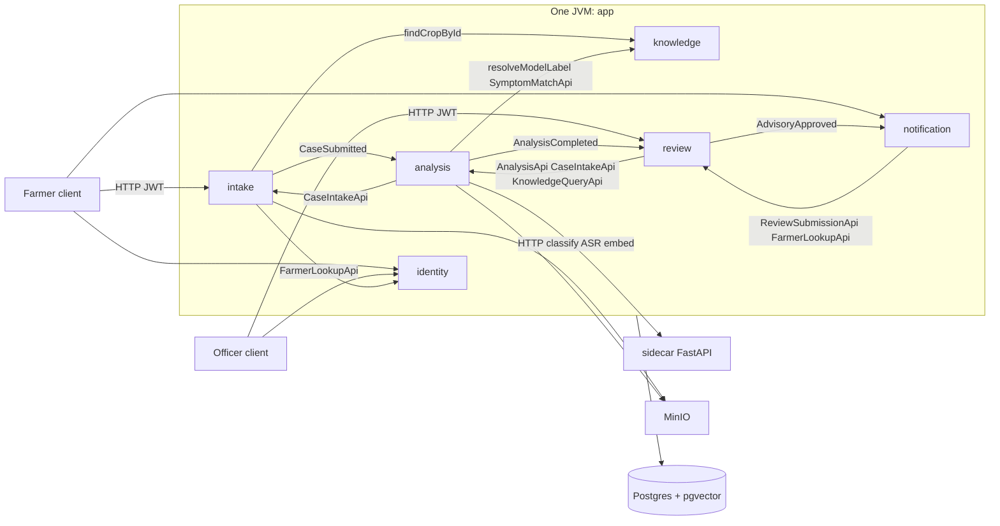
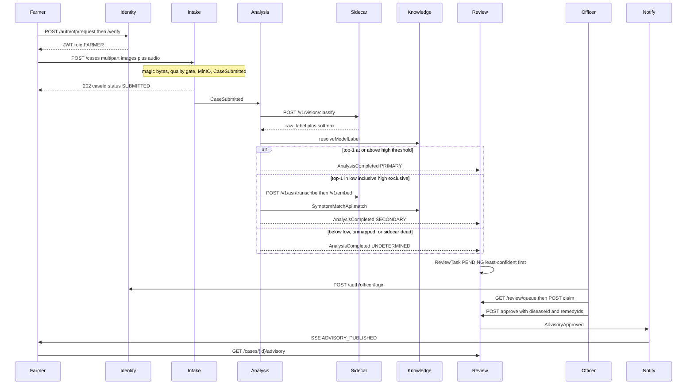

# Foshol Doctor — application walkthrough

This document describes the **running backend** (Spring Modulith + inference sidecar) and the **frozen HTTP contract** in [`openapi/foshol-api.yaml`](openapi/foshol-api.yaml). The Angular app under `web/` is owned by a separate frontend engineer and is not assumed to exist here; farmers and officers talk to the same HTTP API either way.

The product sentence everything else exists to make true:

> **No farmer in this system has ever received unverified pesticide advice.**

The AI ranks diseases and extracts Bangla symptoms. A named field officer publishes (or rejects) every case. Advice is knowledge-base text selected by that officer, not model-generated copy.

Base URL in local development: `http://localhost:8080`. All application APIs live under `/api/v1`. Errors are RFC 9457 `application/problem+json`. Instants are UTC with a `Z` suffix. Authenticated calls send `Authorization: Bearer <jwt>`. Optional `X-Correlation-Id` is adopted when present and returned on every response.

Demo identities (Spring profile `demo`): farmer phone `+8801711111111` with OTP `123456`; officer `officer` / `password`; admin `admin` / `password`. Rice crop id in the scaffold migrations: `01800000-0000-7000-8000-000000000001`.

---

## 1. Project structure

The repository is one JVM deployable (`app`) plus a Python inference process (`sidecar`). Gradle subprojects match Spring Modulith modules. A module may import **only** another module’s `api` package. Domain events live in `common`, not in publisher APIs, so event flow can run against the call graph without creating a module cycle.

```
foshol-doctor/
├── common/                 shared kernel (no Spring beans)
├── app/                    Spring Boot process, Flyway, architecture tests
├── modules/
│   ├── identity/           farmers, officers, JWT
│   ├── knowledge/          crops, diseases, remedies, symptom matcher
│   ├── intake/             cases, uploads, quality gate, status machine
│   ├── analysis/           vision + ASR orchestration, confidence routing
│   ├── review/             officer queue, advisory, rejection
│   └── notification/       SSE (and disabled SMS / Web Push adapters)
├── sidecar/                FastAPI: classify, Grad-CAM, transcribe, embed
├── tools/                  eval.py, seed_cases.py, build_fixtures.py
├── docs/openapi/           frozen HTTP contract
└── docker-compose.yml      Postgres+pgvector, MinIO, optional sidecar, Caddy TLS
```

### Why the modules are separate

| Module | Why it exists |
|---|---|
| **common** | One spelling of enums, property names, error codes and event records. Without it, seven workstreams invent seven `CaseStatus` strings and Modulith verification fails. |
| **identity** | The only writer of `farmer` / `field_officer` / OTP rows and the only minter of JWTs. Phone numbers are hashed for lookup and AES-GCM encrypted at rest. |
| **knowledge** | The **authoritative** taxonomy and remedies. Analysis can be wrong; this module never calls a model and never invents a dosage. |
| **intake** | Sole writer of `diagnosis_case.status`. Uploads, magic-byte sniffing, blur/exposure gate, MinIO, idempotency. |
| **analysis** | Orchestrates sidecar calls and **routes** PRIMARY / SECONDARY / UNDETERMINED. It does not host weights and does not author advice. |
| **review** | The product. Every analysis outcome, including sidecar failure, becomes a `ReviewTask`. Advice is published only here. |
| **notification** | Makes approval **visible** (SSE). Does not decide anything. |
| **sidecar** | Stateless inference. Speaks **raw model labels**, never Foshol disease codes. No database. |

`analysis` and `knowledge` are split on purpose: that split is the safety argument. The model proposes; the knowledge base states what is true; the officer is the gate.

### How they communicate

There are exactly two legal cross-module mechanisms:

1. **Synchronous published APIs** (`*.api` Java interfaces), constrained by the dependency matrix below.
2. **In-process domain events** (Spring Modulith `@ApplicationModuleListener`), typed as records in `com.rootcause.foshol.common.events`.

There is no message broker. HTTP is used only for the browser/client and for `analysis` → sidecar.

**Call graph (synchronous):**

| Caller | May call |
|---|---|
| identity | common only |
| knowledge | common only |
| intake | identity (`FarmerLookupApi`), knowledge (`findCropById`) |
| analysis | intake (`CaseIntakeApi`), knowledge (`KnowledgeQueryApi`, `SymptomMatchApi`) |
| review | identity, intake, analysis, knowledge |
| notification | identity, review (`ReviewSubmissionApi`) |

Nothing calls `review` or `notification` synchronously. They are event-driven.

**Event flow (asynchronous, all types in `common.events`):**

| Event | Publisher | Consumers | Effect |
|---|---|---|---|
| `CaseSubmitted` | intake | analysis | Start vision (± speech) pipeline |
| `CaseStatusChanged` | intake | notification, intake (history projection) | SSE status; farmer history row |
| `AnalysisCompleted` | analysis | review, intake | Create `ReviewTask`; status `ANALYSED` |
| `AnalysisFailed` | analysis | review, intake | Still a `ReviewTask` (UNDETERMINED path); status `FAILED` |
| `AdvisoryApproved` | review | notification, intake | SSE to farmer; status `ADVISED` |
| `AdvisoryRevised` | review | notification | Second notification; prior advisory retained |
| `CaseRejected` | review | notification, intake | SSE; status `REJECTED` (terminal) |



### What each module holds (packages)

Every feature module follows the same layering. ArchUnit and Modulith enforce it on every build.

| Package | Contents | May depend on |
|---|---|---|
| `api/` | Published interfaces and view records. Frozen. | `common` |
| `domain/` | Aggregates, specifications, domain exceptions. **No Spring, JPA or Jackson.** | `common` |
| `application/command` | Commands + one handler each | domain, ports |
| `application/query` | Queries, handlers, read models. Must not load JPA `@Entity`. | ports |
| `application/port` | Outbound ports (`VisionModelPort`, `ImageStorePort`, …) | — |
| `infrastructure/` | JPA entities, adapters, `@ApplicationModuleListener` | application |
| `web/` | Controllers: bind, call **one** handler, map. No domain types. | application |

`common` holds enums (`CaseStatus`, `DecisionPath`, `Role`, …), `ConfigKeys`, `ErrorCodes`, `Uuid7`, `CorrelationId`, `BanglaNormalizer`, and every event record (`CaseSubmitted`, `AnalysisCompleted`, `AdvisoryApproved`, …). Payload types referenced by events (`CaseImageRef`, `CandidateView`, …) live here as well, so consumers do not import another module’s `api` package.

`app` is the process: `FosholDoctorApplication`, Flyway `V1`–`V17` plus demo seeds `V100`–`V101`, `application*.properties`, correlation-id filter, RFC 9457 validation handler, `ArchitectureTests`, `ModularityTests`, and the slice tests `PhotoToReviewTaskIT` / `SidecarUnavailableUndeterminedIT`.

The sidecar is **not** a Modulith module. Analysis reaches it through `VisionModelPort` / `SpeechToTextPort` / `TextEmbeddingPort` / `ExplainabilityPort`. Replay adapters read SHA-256-keyed fixtures; live adapters use HTTP. If the sidecar is down, analysis still publishes `AnalysisCompleted` with `decisionPath = UNDETERMINED` so the officer queue never stalls.

---

## 2. End-to-end workflow

The path below is the one that includes **Bangla speech** (decision path `SECONDARY` when vision is uncertain). Image-only high-confidence cases skip ASR and go `PRIMARY`. Blurry images never enter the pipeline at all.



### 2.1 Farmer authenticates

Farmers do not use a password. They request a one-time code for an E.164 phone that already exists as a `farmer` row (demo: `+8801711111111`). In `local` / `demo` / `test`, `foshol.auth.otp.dev-code` is `123456` (or `000000` in test). In any other profile that property is forbidden and the process refuses to start.

`POST /api/v1/auth/otp/request` always looks like success for a well-formed phone (`202`) so callers cannot probe which numbers are registered. `POST /api/v1/auth/otp/verify` returns a JWT (`sub` = farmer id, `role` = `FARMER`, HS256, TTL `foshol.auth.jwt.ttl`, default 8 hours). There is no refresh token.

### 2.2 Farmer chooses a crop and captures evidence

`GET /api/v1/crops` lists rice, tomato and potato. The farmer takes one to three leaf photographs and, for the speech path, a short Bangla recording (WAV / WebM / OGG / MP4, max 30 s). The client should send JPEG/PNG/WebP; the server **ignores** the declared `Content-Type` and sniffs magic bytes (`COMMON-SEC-014`). Safari’s `audio/mp4` is accepted.

### 2.3 Submit — quality gate before anything is stored

`POST /api/v1/cases` with header `Idempotency-Key: <uuid>` (required). Multipart fields: `cropId`, `images` (1–3), optional `noteBn`, optional `audio`, optional `parentCaseId` (only when resubmitting after a rejection).

Intake, in order:

1. Authenticate as `FARMER`; rate-limit 20 cases per farmer per hour.
2. Resolve crop via `KnowledgeQueryApi.findCropById`; copy `districtCode` from `FarmerLookupApi`.
3. Sniff types; reject `415` / `413` on type or size.
4. **Quality gate** (Laplacian blur variance, exposure, minimum edge). Failure is `422` with `QualityGateProblem`. **Nothing** is written to MinIO or Postgres.
5. Store original plus a resized derivative; persist `diagnosis_case` (`SUBMITTED`), images, optional audio, idempotency row.
6. Publish `CaseSubmitted`.
7. Return `202` `{ "caseId", "status": "SUBMITTED" }`. Repeating the same key and body replays that response; a different body with the same key is `409`.

Status is now `SUBMITTED` then quickly `ANALYSING` as analysis starts.

### 2.4 Analysis — vision, optional speech, routing

The analysis module listens for `CaseSubmitted` and fans work out on virtual threads with deadline `foshol.analysis.deadline` (12 s live, shorter in test). It never uses Java preview `StructuredTaskScope`.

**Vision.** Each image is classified. Replay mode (`foshol.ai.mode=replay`, demo default) looks up a fixture by SHA-256. Live mode POSTs to the sidecar `/v1/vision/classify`. Multi-image scores use `MAX` aggregation. Raw labels are mapped through `KnowledgeQueryApi.resolveModelLabel(modelId, modelVersion, rawLabel)` — **never** by string-matching disease names. Unmapped labels are stored on `analysis_run.unmapped_labels` and dropped from candidates. Grad-CAM (when enabled) is stored in MinIO; officers toggle the overlay from `GET .../gradcam`.

**Routing (`ConfidenceRouter`) on raw (or temperature-scaled) top-1 softmax.** Defaults `high = 0.75`, `low = 0.45` (human-owned; agents must not “tune” them).

| Condition | `decisionPath` | Speech? |
|---|---|---|
| top-1 ≥ high and label mapped and a remedy exists | `PRIMARY` | No |
| low ≤ top-1 < high, or primary cannot prescribe | `SECONDARY` | Yes, if audio is present |
| top-1 < low, all labels unmapped, ASR/embed failed, or sidecar circuit open | `UNDETERMINED` | Best-effort only |

**Speech (SECONDARY).** Sidecar `/v1/asr/transcribe` then `/v1/embed` (768-d LaBSE). Analysis writes the transcript onto the case via `CaseIntakeApi.recordTranscript`. `SymptomMatchApi.match` runs pgvector kNN on `symptom_phrase.embedding`, then a fuzzy token-overlap fallback, then weighted `disease_symptom` scoring. Symptoms are stored with `source = SPEECH`. Model candidates (`MODEL`) and knowledge-base scores (`KB`) are merged (`MERGED`) and re-ranked.

**Degradation.** If the sidecar is killed, analysis still emits `AnalysisCompleted` with `UNDETERMINED` and `errorCode` set (for example `ERR_SIDECAR_UNAVAILABLE`). Review **must** still create a `ReviewTask`. That is demo beat 8.

Analysis persists `analysis_run`, `case_candidate`, `case_symptom`. Intake sets `decision_path` and status `ANALYSED` from the event.

### 2.5 Officer queue — human gate

Review listens to **both** `AnalysisCompleted` and `AnalysisFailed` and inserts `review_task` plus a row in `p_officer_queue`. Sort is fixed: `state`, `top_confidence ASC NULLS FIRST`, `submitted_at ASC` (least confident first). Clients cannot change sort.

The officer logs in with username/password, opens `GET /api/v1/review/queue`, then `POST /api/v1/review/tasks/{taskId}/claim` (TTL `foshol.review.claim.ttl`, default 15 minutes; a sweeper returns expired claims to `PENDING`). Detail `GET /api/v1/review/tasks/{taskId}` composes case + analysis + suggested remedies from the knowledge base for the top disease. The officer may record extra symptoms (`source = OFFICER`) via `AnalysisApi.recordOfficerSymptoms` — review never writes `case_symptom` itself.

### 2.6 Approve, edit, replace, or reject

**Publish** `POST .../approve` with a disease and one or more remedy ids drawn from the knowledge base. Chemical remedies must have `phi_days`. The handler derives `AdvisoryAction`:

- `APPROVED` — officer kept the model’s top disease and its default remedy set
- `EDITED` — same disease, different remedies or note
- `REPLACED` — different disease

OpenAPI also documents `action` and `expectedVersion` on the request; the current Java body is `{ diseaseId, remedyIds, officerNoteBn }` and derives `action`. Prefer sending the OpenAPI fields when the frontend lands; extra JSON properties are ignored by Jackson unless configured otherwise.

An `advisory` row is appended (version 1, `supersedes_id` null). Later corrections use `POST /api/v1/advisories/{id}/revise` (append-only; version N+1). `AdvisoryApproved` / `AdvisoryRevised` fire. Intake sets status `ADVISED`.

**Reject** is terminal (`BLURRY_IMAGE`, `NOT_A_CROP`, …). The farmer must submit a **new** case with `parentCaseId` set; the old case does not reopen.

### 2.7 Farmer sees verified advice

Notification listens for `AdvisoryApproved`, loads `ReviewSubmissionApi.findPublishedAdvisory`, composes Bangla title/body, writes a `notification` row, and pushes SSE `ADVISORY_PUBLISHED` on `GET /api/v1/stream` (farmer connection, own cases only). The farmer then `GET /api/v1/cases/{id}/advisory` and sees officer name, disease, steps, dosage, PHI — content that came from the knowledge base and the officer’s selection, not from the classifier.

`SmsChannel` and `WebPushChannel` are real Spring beans registered on the channel port and **disabled** (`foshol.channels.sms.enabled=false`, `webpush` likewise). They exist to show that a new transport is an adapter, not a rewrite.

### 2.8 Case status machine (intake is the only writer)

```
SUBMITTED → ANALYSING → ANALYSED → IN_REVIEW → ADVISED
                                    ↘ REJECTED
         ↘ FAILED (analysis failed; still queued as UNDETERMINED)
```

`IN_REVIEW` is entered when the officer claims. `ADVISED` / `REJECTED` are terminal except that a **new** case may point at a rejected parent.

---

## 3. API reference

Convention: lists are paginated with `page` (0-based) and `size` (default 20, max 100) unless noted. Collection JSON shape:

```json
{
  "content": [],
  "page": 0,
  "size": 20,
  "totalElements": 0,
  "totalPages": 0
}
```

Problem envelope (all errors):

```json
{
  "type": "https://foshol.local/problems/case-not-found",
  "title": "Case not found",
  "status": 404,
  "detail": "No case with that identifier is visible to you.",
  "instance": "/api/v1/cases/018f0000-0000-7000-8000-000000000001",
  "code": "ERR_CASE_NOT_FOUND",
  "correlationId": "8f2c0a1b-2c3d-4e5f-8a9b-0c1d2e3f4a5b"
}
```

`404` is used (never `403`) when a farmer asks for another farmer’s case, so ownership is not probeable.

Roles: `FARMER`, `OFFICER`, `ADMIN`. Endpoints under `/api/v1` require a JWT except `/api/v1/auth/**`. `/actuator/health` is unauthenticated.

---

### 3.1 Auth

#### `POST /api/v1/auth/otp/request`

Unauthenticated. Starts an OTP challenge for a farmer phone.

**Request**

```json
{ "phone": "+8801711111111" }
```

| Field | Type | Notes |
|---|---|---|
| `phone` | string | E.164. Never logged. |

**Response** `202` empty body. Rate limit: `429` + `Retry-After` after 3 requests per phone hash per 10 minutes.

**Usage:** call before the farmer types the six-digit code. Do not branch on “unknown phone”; the status is the same.

#### `POST /api/v1/auth/otp/verify`

**Request**

```json
{ "phone": "+8801711111111", "code": "123456" }
```

**Response** `200`

```json
{
  "token": "eyJhbGciOiJIUzI1NiIsInR5cCI6IkpXVCJ9...",
  "expiresAt": "2026-09-08T12:00:00Z",
  "principal": {
    "id": "01800000-0000-7000-8000-000000000201",
    "name": "Demo Farmer",
    "role": "FARMER",
    "districtCode": "DHA",
    "preferredLanguage": "bn"
  }
}
```

`401` on wrong/expired code; `ERR_OTP_ATTEMPTS_EXCEEDED` after max attempts.

#### `POST /api/v1/auth/officer/login`

**Request**

```json
{ "username": "officer", "password": "password" }
```

**Response** `200` — same `AuthResponse` shape; `principal.role` is `OFFICER` or `ADMIN`. Inactive officers get `ERR_ACCOUNT_INACTIVE`.

#### `GET /api/v1/me`

Bearer required. Returns the `Principal` object (no token).

---

### 3.2 Knowledge (read-only)

No admin write API in this build. Content is Flyway. Bangla is the language of record; if `nameEn` is null the API may set `nameEnFallback: true` and repeat `nameBn`.

#### `GET /api/v1/crops`

**Response** `200`

```json
[
  {
    "id": "01800000-0000-7000-8000-000000000001",
    "code": "rice",
    "nameBn": "rice",
    "nameEn": "Rice",
    "nameEnFallback": false,
    "iconKey": "crop-rice"
  }
]
```

Use `id` as `cropId` on case submit. Scaffold `nameBn` is still awaiting content-owner C2.

#### `GET /api/v1/crops/{cropId}/diseases`

**Response** `200` array of `Disease`. `404` if crop missing.

```json
{
  "id": "01800000-0000-7000-8000-000000000101",
  "cropId": "01800000-0000-7000-8000-000000000001",
  "code": "rice_blast",
  "nameBn": "rice_blast",
  "nameEn": "Blast",
  "nameEnFallback": false,
  "descriptionBn": null,
  "severity": "MODERATE",
  "healthy": false
}
```

#### `GET /api/v1/diseases/{diseaseId}`

Single `Disease`. `404` → `ERR_DISEASE_NOT_FOUND`.

#### `GET /api/v1/diseases/{diseaseId}/remedies`

Active remedies, display order. Empty until content-owner C6–C8 land. Shape:

```json
{
  "id": "018f...",
  "diseaseId": "018f...",
  "type": "CHEMICAL",
  "titleBn": "...",
  "stepsBn": ["পাতা তুলে ফেলুন", "স্প্রে করুন"],
  "dosageBn": "...",
  "phiDays": 14,
  "costTier": "MEDIUM",
  "efficacy": "HIGH",
  "sourceRef": "BRRI ... 2020"
}
```

`phiDays` is mandatory in the database when `type` is `CHEMICAL`.

#### `GET /api/v1/symptoms`

Closed vocabulary for officer chips and matcher. `organ` ∈ `LEAF|STEM|ROOT|PANICLE|FRUIT|TUBER|WHOLE`.

---

### 3.3 Cases (farmer)

#### `POST /api/v1/cases`

Role `FARMER`. Header `Idempotency-Key` required (UUID).

```bash
curl -sS -X POST "http://localhost:8080/api/v1/cases" \
  -H "Authorization: Bearer $FARMER_JWT" \
  -H "Idempotency-Key: 018f0000-0000-7000-8000-00000000beef" \
  -H "X-Correlation-Id: walkthrough-1" \
  -F "cropId=01800000-0000-7000-8000-000000000001" \
  -F "noteBn=পাতায় দাগ" \
  -F "images=@leaf.jpg;type=image/jpeg" \
  -F "audio=@note.m4a;type=audio/mp4"
```

**Response** `202`

```json
{ "caseId": "018f1111-0000-7000-8000-000000000001", "status": "SUBMITTED" }
```

| Status | When |
|---|---|
| 202 | Accepted (or idempotent replay of the same body) |
| 400 | Validation (missing crop, zero images, …) |
| 401 | No/invalid JWT |
| 409 | Same idempotency key, different body |
| 413 | File too large |
| 415 | Magic bytes not in allowed image/audio types |
| 422 | Quality gate; `rejectedImages[].reason` ∈ `BLURRY|UNDEREXPOSED|OVEREXPOSED|TOO_SMALL|UNREADABLE` |
| 429 | 20 cases / hour |
| 503 | MinIO down — **no partial case** |

Resubmit after rejection: add `-F "parentCaseId=<rejected-case-uuid>"`.

#### `GET /api/v1/cases`

Farmer’s history, newest first. Query `page`, `size`.

**Response** `200` `PageOfFarmerCaseRow`

```json
{
  "content": [
    {
      "caseId": "018f1111-0000-7000-8000-000000000001",
      "cropNameBn": "rice",
      "status": "ADVISED",
      "decisionPath": "SECONDARY",
      "diseaseNameBn": "rice_blast",
      "officerName": "Demo Officer",
      "advisoryVersion": 1,
      "rejectionMessageBn": null,
      "thumbnailImageId": "018f2222-0000-7000-8000-000000000001",
      "submittedAt": "2026-09-07T12:00:00Z",
      "publishedAt": "2026-09-07T12:05:00Z"
    }
  ],
  "page": 0,
  "size": 20,
  "totalElements": 1,
  "totalPages": 1
}
```

#### `GET /api/v1/cases/{caseId}`

**Response** `200` `CaseDetail`

```json
{
  "caseId": "018f1111-0000-7000-8000-000000000001",
  "cropId": "01800000-0000-7000-8000-000000000001",
  "cropNameBn": "rice",
  "status": "ANALYSED",
  "decisionPath": "SECONDARY",
  "noteBn": "পাতায় দাগ",
  "parentCaseId": null,
  "images": [
    {
      "imageId": "018f2222-0000-7000-8000-000000000001",
      "position": 0,
      "primary": true,
      "qualityScore": 0.82,
      "width": 1024,
      "height": 768
    }
  ],
  "audio": {
    "audioId": "018f3333-0000-7000-8000-000000000001",
    "durationMs": 4200,
    "transcriptBn": "পাতা হলুদ হয়ে যাচ্ছে"
  },
  "submittedAt": "2026-09-07T12:00:00Z"
}
```

Farmers see only their cases; officers may see any. Foreign farmer id → `404`.

#### `GET /api/v1/cases/{caseId}/images/{imageId}/content?variant=DERIVATIVE`

`302` to a time-limited presigned MinIO URL (`foshol.storage.presign-ttl`, default 10 minutes). `variant=ORIGINAL` for the uploaded bytes. After ownership check only.

---

### 3.4 Analysis

#### `GET /api/v1/cases/{caseId}/analysis`

The **only** HTTP endpoint allowed to expose raw model label strings (`unmappedLabels`). Officers use this (and the task detail composite). Farmers may be restricted in the UI; the API still 404s other farmers’ ids.

**Response** `200` `AnalysisDetail`

```json
{
  "caseId": "018f1111-0000-7000-8000-000000000001",
  "decisionPath": "SECONDARY",
  "mode": "REPLAY",
  "top1Confidence": 0.61,
  "top2Confidence": 0.22,
  "margin": 0.39,
  "candidates": [
    {
      "diseaseId": "01800000-0000-7000-8000-000000000101",
      "diseaseCode": "rice_blast",
      "diseaseNameBn": "rice_blast",
      "confidence": 0.61,
      "rank": 1,
      "source": "MERGED"
    }
  ],
  "symptoms": [
    {
      "symptomId": "018f...",
      "symptomCode": "leaf_yellow",
      "nameBn": "...",
      "score": 0.81,
      "source": "SPEECH",
      "matcher": "VECTOR"
    }
  ],
  "transcriptBn": "পাতা হলুদ হয়ে যাচ্ছে",
  "asrConfidence": 0.74,
  "hasGradcam": true,
  "unmappedLabels": [],
  "visionModelId": "kssrikar4/Rice-Leaf-Disease-Classification",
  "visionModelVersion": "02a6e6ea1b5da9b0458b12c4ec8bccd0582a4f26",
  "latencyMs": 840,
  "errorCode": null,
  "thresholds": { "high": 0.75, "low": 0.45 }
}
```

`source` on candidates: `MODEL` (vision), `KB` (matcher), `MERGED` (SECONDARY fusion). `mode` is `REPLAY` or `LIVE` so nobody mistakes a fixture for field inference. Draw confidence bars using `thresholds`, do not recompute the path in the client.

When the sidecar is down: `decisionPath` is `UNDETERMINED`, `errorCode` is set, `candidates` may be empty — the case is still in the officer queue.

#### `GET /api/v1/cases/{caseId}/gradcam`

`302` to the overlay PNG, or `404` if none.

---

### 3.5 Review (officer / admin)

All `/api/v1/review/**` require `OFFICER` or `ADMIN`.

#### `GET /api/v1/review/queue`

Query: optional `state=PENDING|CLAIMED|DONE|REJECTED`, plus `page` / `size`. **No sort parameter.**

**Response** `200` `PageOfOfficerQueueRow`

```json
{
  "content": [
    {
      "caseId": "018f1111-0000-7000-8000-000000000001",
      "reviewTaskId": "018f4444-0000-7000-8000-000000000001",
      "farmerName": "Demo Farmer",
      "cropCode": "rice",
      "cropNameBn": "rice",
      "districtCode": "DHA",
      "decisionPath": "UNDETERMINED",
      "topDiseaseNameBn": null,
      "topConfidence": null,
      "imageCount": 1,
      "hasAudio": true,
      "analysisMode": "REPLAY",
      "state": "PENDING",
      "officerId": null,
      "isResubmission": false,
      "submittedAt": "2026-09-07T12:00:00Z",
      "slaDueAt": "2026-09-07T16:00:00Z"
    }
  ],
  "page": 0,
  "size": 20,
  "totalElements": 1,
  "totalPages": 1
}
```

Null confidence sorts first (sidecar-kill and UNDETERMINED).

#### `GET /api/v1/review/tasks/{taskId}`

Composite `ReviewCaseDetail`: `task`, `case`, `farmerName`, `analysis`, `suggestedDiseaseId`, `suggestedRemedies`, optional `priorAdvisory`.

Use `task.version` if you implement optimistic locking on write (OpenAPI `expectedVersion`).

#### `POST /api/v1/review/tasks/{taskId}/claim`

No body. **Response** `200` `ReviewTask` with `state: CLAIMED`, `officerId`, `claimedAt`, `claimExpiresAt`. `409` if already claimed (`ERR_CLAIM_CONFLICT`).

#### `POST /api/v1/review/tasks/{taskId}/release`

Returns the task to `PENDING`. Current implementation responds `204`. Caller must hold the claim.

#### `POST /api/v1/review/tasks/{taskId}/symptoms`

Officer-observed chips. **Request** `{ "symptomIds": ["018f-..."] }`. **Response** `204`. Persisted as `case_symptom.source = OFFICER` via analysis, not a direct SQL write from review.

#### `POST /api/v1/review/tasks/{taskId}/approve`

Publishes version 1 (or the next version if you use revise). **Response** `201` + `Location: /api/v1/cases/{caseId}/advisory`.

OpenAPI request:

```json
{
  "action": "EDITED",
  "diseaseId": "01800000-0000-7000-8000-000000000101",
  "remedyIds": ["018f5555-0000-7000-8000-000000000001"],
  "officerNoteBn": "মাত্রা কমান — ফুল আসার আগে",
  "expectedVersion": 0
}
```

Current Java handler body (action derived server-side):

```json
{
  "diseaseId": "01800000-0000-7000-8000-000000000101",
  "remedyIds": ["018f5555-0000-7000-8000-000000000001"],
  "officerNoteBn": "মাত্রা কমান — ফুল আসার আগে"
}
```

**Response** `Advisory`

```json
{
  "advisoryId": "018f6666-0000-7000-8000-000000000001",
  "caseId": "018f1111-0000-7000-8000-000000000001",
  "diseaseId": "01800000-0000-7000-8000-000000000101",
  "diseaseNameBn": "rice_blast",
  "officerId": "01800000-0000-7000-8000-000000000202",
  "officerName": "Demo Officer",
  "action": "EDITED",
  "officerNoteBn": "মাত্রা কমান — ফুল আসার আগে",
  "version": 1,
  "supersedesId": null,
  "remedies": [],
  "publishedAt": "2026-09-07T12:05:00Z"
}
```

`400` if chemical PHI missing or remedies do not belong to the disease. `409` if the task is not claimed by this officer or is already terminal.

#### `POST /api/v1/review/tasks/{taskId}/reject`

```json
{
  "reasonCode": "BLURRY_IMAGE",
  "messageBn": "আরেকটি স্পষ্ট ছবি তুলে আবার পাঠান।",
  "expectedVersion": 1
}
```

**Response** `200` `Rejection`. Farmer must open a new case with `parentCaseId`.

#### `GET /api/v1/cases/{caseId}/advisory`

Current published advisory (farmer: own case; officer: any). `404` if none yet.

#### `GET /api/v1/cases/{caseId}/advisories`

All versions, newest first. Prior rows stay; `supersedesId` links them.

#### `POST /api/v1/advisories/{advisoryId}/revise`

Same body as approve. Creates version N+1, fires `AdvisoryRevised`, notifies the farmer again that advice **changed**.

---

### 3.6 Admin

#### `GET /api/v1/admin/stats`

Role `ADMIN` only.

```json
{
  "casesToday": 12,
  "approvalRate": 0.75,
  "medianReviewSeconds": 95,
  "modelOfficerAgreementRate": 0.62,
  "advisoriesPublished": 8,
  "casesRejected": 2,
  "pathCounts": { "PRIMARY": 5, "SECONDARY": 4, "UNDETERMINED": 3 },
  "thresholds": { "high": 0.75, "low": 0.45 }
}
```

`modelOfficerAgreementRate` is the share of published advisories whose `diseaseId` equals the top `MODEL` candidate — the retraining *signal*, not a quoted model-card accuracy. Do not display third-party F1/WER numbers anywhere.

---

### 3.7 Stream (SSE)

#### `GET /api/v1/stream`

`Accept: text/event-stream`. Bearer required. Farmers receive events for **their** cases; officers receive queue nudges. Heartbeat every `foshol.channels.sse.heartbeat` (20 s).

```
GET /api/v1/stream HTTP/1.1
Authorization: Bearer $FARMER_JWT
```

Event names: `CASE_STATUS_CHANGED`, `ADVISORY_PUBLISHED`, `ADVISORY_REVISED`, `CASE_REJECTED`, `QUEUE_CHANGED`.

Example frame after approval:

```
event: ADVISORY_PUBLISHED
id: 018f6666-0000-7000-8000-000000000001
data: {"caseId":"018f1111-0000-7000-8000-000000000001","advisoryId":"018f6666-0000-7000-8000-000000000001","officerName":"Demo Officer","type":"ADVISORY_PUBLISHED"}

```

Then `GET /api/v1/cases/{caseId}/advisory` for the full remedy list. `Last-Event-ID` replay on the server is `[DEFERRED]`; clients should resync by re-reading the case.

---

### 3.8 Inference sidecar (not public)

Bound on `foshol.ai.base-url` (default `http://localhost:8000`). Not exposed through Caddy to phones. Analysis is the only caller. Correlation header is `X-Correlation-Id`. Errors are problem+json with `ERR_SIDECAR_*` codes.

| Method | Path | Purpose |
|---|---|---|
| GET | `/health` | Liveness; replay reports healthy even if weights are absent |
| GET | `/v1/models` | Configured model ids and pinned revisions |
| POST | `/v1/vision/classify` | Multipart image + `crop_code` → ranked `{ raw_label, confidence }`, `model_id`, `model_version` |
| POST | `/v1/vision/explain` | Overlay PNG (Grad-CAM / attention) |
| POST | `/v1/asr/transcribe` | Bangla audio → `transcript`, confidence |
| POST | `/v1/embed` | JSON `{ "texts": ["..."] }` → 768-d vectors |

The sidecar never returns a Foshol `disease.code`. Mapping is exclusively `model_label_map` inside knowledge.

Replay keys fixtures by SHA-256 of the payload so the same photograph always yields the same ranks in demo mode.

---

## 4. What this walkthrough does not include

- **Angular UI** — routing, capture pipeline, i18n catalogues. Same APIs as above.
- **Production agronomy** — `V18__demo_knowledge_base.sql` fills crops, 14 diseases, symptoms, phrases, remedies, embeddings and `model_label_map` for the dress rehearsal. Every remedy `source_ref` is marked **DEMO ONLY**. Do not treat dosages or PHI as field advice.
- **Admin CRUD** for diseases/remedies — deferred; stats page only.
- **Training** — there is none. Weights are pretrained identifiers in config.

For the machine-readable contract, always treat [`openapi/foshol-api.yaml`](openapi/foshol-api.yaml) as source of truth when it and a Java record disagree; raise a blocker rather than widening the `api` package.
